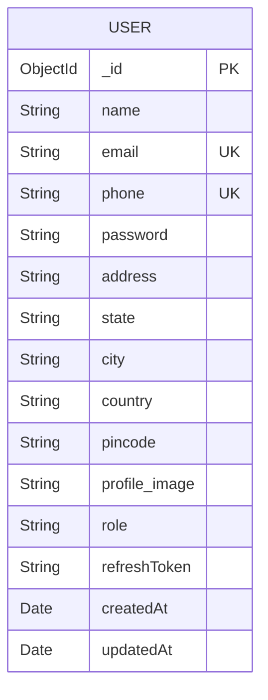

# User Management System

A full-stack MERN application for managing users with authentication, role-based access control, and CRUD operations.

## Setup Instructions

### Prerequisites
- Node.js (v16 or higher)
- MongoDB (local or Atlas)
- npm or yarn

### Backend Setup

1. Navigate to backend directory:
```bash
cd backend
```

2. Install dependencies:
```bash
npm install
```

3. Create `.env` file from `.env.example`:
```bash
cp .env.example .env
```

4. Update `.env` with your configuration:
```env
PORT=5000
MONGODB_URI=mongodb://localhost:27017/user_management
JWT_ACCESS_SECRET=your_access_secret_key_here
JWT_REFRESH_SECRET=your_refresh_secret_key_here
JWT_ACCESS_EXPIRY=1h
JWT_REFRESH_EXPIRY=7d
CLIENT_URL=http://localhost:5173
```

5. Start MongoDB (if running locally):
```bash
mongod
```

6. Start the backend server:
```bash
npm run dev
```

The backend will run on `http://localhost:5000`

### Frontend Setup

1. Navigate to frontend directory:
```bash
cd frontend
```

2. Install dependencies:
```bash
npm install
```

3. Start the development server:
```bash
npm run dev
```

The frontend will run on `http://localhost:5173`

## API Endpoints

### Authentication Routes

| Method | Endpoint | Description | Access |
|--------|----------|-------------|--------|
| POST | `/api/auth/register` | Register new user | Public |
| POST | `/api/auth/login` | Login user | Public |
| POST | `/api/auth/refresh` | Refresh access token | Public |
| POST | `/api/auth/logout` | Logout user | Private |

### User Routes (Admin Only)

| Method | Endpoint | Description | Access |
|--------|----------|-------------|--------|
| GET | `/api/users` | Get all users with filters | Admin |
| GET | `/api/users/:id` | Get user by ID | Admin |
| PUT | `/api/users/:id` | Update user | Admin |
| DELETE | `/api/users/:id` | Delete user | Admin |

## Validation Rules

### Registration
- **Name**: Minimum 3 characters, alphabets only
- **Email**: Valid email format, unique
- **Phone**: 10-15 digits, unique
- **Password**: Minimum 6 characters with at least one number
- **Address**: Optional, maximum 150 characters
- **State, City, Country**: Required
- **Pincode**: 4-10 digits
- **Profile Image**: JPG/PNG, max 2MB

## Security Features

- Password hashing with bcrypt
- JWT authentication with access and refresh tokens
- Token expiry and automatic refresh
- Role-based access control
- CORS protection
- Helmet for security headers
- Rate limiting (100 requests per 15 minutes, 5 login attempts per 15 minutes)
- Input validation
- File upload restrictions

## Testing the Application

### Create Admin User

Since this is a new system, you'll need to create an admin user manually in MongoDB:

1. Register a user through the frontend
2. Connect to MongoDB and update the user's role:

```javascript
use user_management
db.users.updateOne(
  { email: "admin@example.com" },
  { $set: { role: "admin" } }
)
```

### Default Credentials (After Manual Setup)
- Email: admin@example.com
- Password: (your chosen password)

## ER Diagram



## Architecture Diagram

```
┌─────────────────────────────────────────────────────────────┐
│                         CLIENT LAYER                         │
│  ┌────────────────────────────────────────────────────────┐  │
│  │   React App (Vite)                                     │  │
│  │   - Components (Navbar, ProtectedRoute)                │  │
│  │   - Pages (Login, Register, Dashboard, etc.)           │  │
│  │   - Context (AuthContext)                              │  │
│  │   - Services (API calls with Axios)                    │  │
│  │   - Bootstrap 5 UI                                     │  │
│  └────────────────────────────────────────────────────────┘  │
└───────────────────────┬─────────────────────────────────────┘
                        │ HTTP/HTTPS
                        │ (Access Token + Refresh Token)
                        ▼
┌─────────────────────────────────────────────────────────────┐
│                      APPLICATION LAYER                       │
│  ┌────────────────────────────────────────────────────────┐  │
│  │   Express.js Server                                    │  │
│  │   ┌──────────────────────────────────────────────────┐ │  │
│  │   │  Middleware                                       │ │  │
│  │   │  - CORS, Helmet, Rate Limiting                   │ │  │
│  │   │  - Authentication (JWT)                          │ │  │
│  │   │  - Authorization (Role-based)                    │ │  │
│  │   │  - Validation (Joi)                              │ │  │
│  │   │  - File Upload (Multer)                          │ │  │
│  │   │  - Error Handler                                 │ │  │
│  │   └──────────────────────────────────────────────────┘ │  │
│  │   ┌──────────────────────────────────────────────────┐ │  │
│  │   │  Routes                                           │ │  │
│  │   │  - /api/auth (register, login, refresh, logout) │ │  │
│  │   │  - /api/users (CRUD operations)                  │ │  │
│  │   └──────────────────────────────────────────────────┘ │  │
│  │   ┌──────────────────────────────────────────────────┐ │  │
│  │   │  Controllers                                      │ │  │
│  │   │  - authController                                │ │  │
│  │   │  - userController                                │ │  │
│  │   └──────────────────────────────────────────────────┘ │  │
│  └────────────────────────────────────────────────────────┘  │
└───────────────────────┬─────────────────────────────────────┘
                        │ Mongoose ODM
                        ▼
┌─────────────────────────────────────────────────────────────┐
│                       DATABASE LAYER                         │
│  ┌────────────────────────────────────────────────────────┐  │
│  │   MongoDB                                              │  │
│  │   - users collection                                   │  │
│  │   - Indexes on email and phone                         │  │
│  └────────────────────────────────────────────────────────┘  │
└─────────────────────────────────────────────────────────────┘

┌─────────────────────────────────────────────────────────────┐
│                       STORAGE LAYER                          │
│  ┌────────────────────────────────────────────────────────┐  │
│  │   Local File System                                    │  │
│  │   - /uploads (Profile images)                          │  │
│  └────────────────────────────────────────────────────────┘  │
└─────────────────────────────────────────────────────────────┘
```

## Troubleshooting

### MongoDB Connection Issues
- Ensure MongoDB is running
- Check MONGODB_URI in .env file
- Verify network connectivity

### CORS Errors
- Verify CLIENT_URL in backend .env
- Check CORS configuration in server.js

### File Upload Issues
- Ensure uploads directory exists and has write permissions
- Check file size (max 2MB)
- Verify file type (JPG/PNG only)

### Token Issues
- Clear browser localStorage
- Check JWT secrets are set in .env
- Verify token expiry settings

## Production Deployment

### Backend
1. Set NODE_ENV to production
2. Use strong JWT secrets
3. Configure MongoDB Atlas
4. Set up proper CORS origins
5. Use process manager (PM2)
6. Enable HTTPS

### Frontend
1. Build the app: `npm run build`
2. Deploy dist folder to hosting service
3. Update API URLs for production
4. Enable HTTPS

## License

MIT

## Author

Full-Stack Developer
